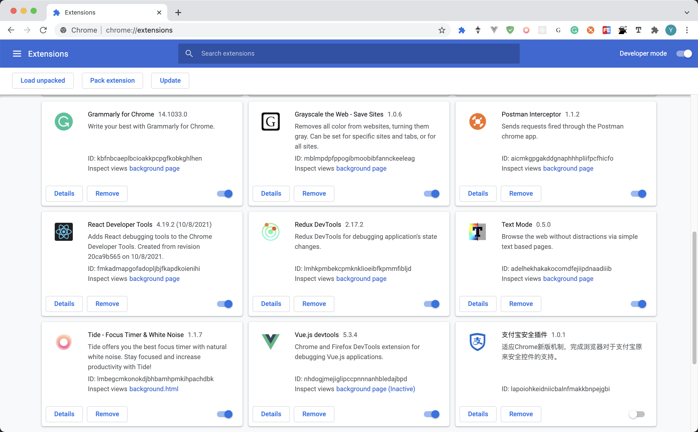
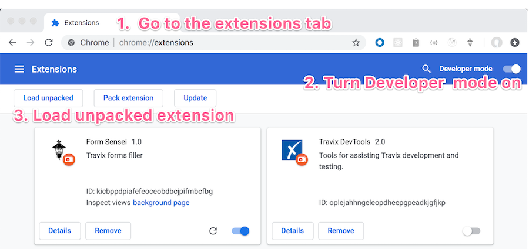
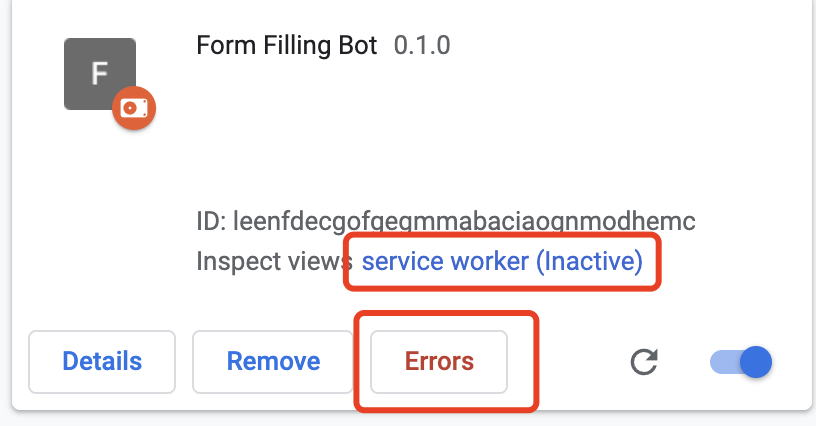
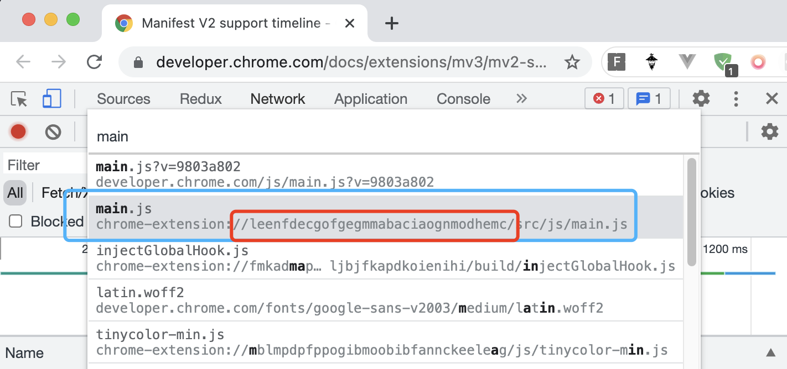

## What is extension

The extensions



---

We saw some recommendation from store often,
We downloaded and tried some of them often,
We even relied on some of them often.

To the users,
extensions are apps,hosted by chrome, make and can make **a chrome** to **their chrome**

To the developers,
extension can be much more that,

It could be **a tool**, **a playground**, **a test runner** or **a bot**, also can be **a tracker, a watcher, or a leaker**.

Make it short, extensions are fun to play, great to help.

## What does the extension be capable of

- Web page control(grammarly)
- Event listening
- Automation (bot, Tampermonkey, )
- Bookmark control；
- Download control；
- Tab control；
- Page script injection(Adblock);

Of course they are powerful, but many abilities need **permissions**,
some even needs **confirmation** by the user.

The extension store has rules to restrict the behavior of apps, in case of **abusing**.

Simply, we can regard it as scripts running on the background, providing the service, and be able to control your chrome.

### How to build my own extension

For us, it's not a problem at all!

All the things are written in pure js,
you can follow this: it's a very professional doc

[Official doc]<https://developer.chrome.com/docs/extensions/>

## Demo time

Let's take a look on this extension demo

## Development

### Requirements

1. js.

   - You can also import JQuery, lodash libs (react may need built file)

2. html, css

   - If the UI is needed

3. cookbook
   - [chrome-extension-api]<https://developer.chrome.com/docs/extensions/reference/>

### First step

`manifest.json`

There must be a `manifest.json`,

Like this

```json manifest.json
{
  "name": "DancingBot",
  "version": "1.0",
  "description": "A dancing bot",
  "background": {
    "service_worker": "./background.js"
  },
  "action": {
    "default_popup": "ui/index.html", // the UI
    "default_icon": {
      "16": "images/16.png" // "32 64 128"
    }
  },
  "icons": {
    "16": "images/16.png" // "32 64 128"
  },
  "permissions": ["activeTab", "contextMenus", "declarativeContent", "storage"],
  "manifest_version": 3 // !
}
```

---

**manifest_version**

`manifest_version`

Decides to connect which version of the extension Api,

It's important because it's like a major version changes,
new features will be added and deprecated ones would be dropped

In 2020 , it comes to the `version 3`, bringing the security updates.

Like

- replacing the background with service workers,
- full promises supports

<https://developer.chrome.com/docs/extensions/mv3/intro/mv3-overview/>

Google also gives a timeline of `mv2`

<https://developer.chrome.com/docs/extensions/mv3/mv2-sunset/>

> By January 2023, v2 Chrome stops running Manifest V2 extensions

Of course, `mv2` still the most popular one.

Chrome 88 is the first one supports `mv3`

---

**permissions**

- activeTab

  - Requests that the extension be granted permissions according to the activeTab specification.

- bookmarks

  - access to the chrome.bookmarks

- clipboardRead/ clipboardWrite

  - it's Required if extension using `document.execCommand('paste'|'copy'|'cut')`

- declarativeContent

  - access to the chrome.declarativeContent

- downloads

  - access to the chrome.downloads

- geolocation

  - access to the chrome.geolocation

- history

  - access to the chrome.history

## Load your own extension

It's not complicated, and no need to compile it

Usually the final built file of an extension is a `.crx` file,

But we don't have to publish it on the chrome extension store,
We can just load the **development root folder**

1. Clone this repository
2. Open `chrome://extensions/` url in your Chrome browser
3. Turn on the `Developer mode`
4. Click `Load unpacked` button
5. Select the folder with the extension



## Built a form-filling-bot

Let's fill a form

<https://c3x78.csb.app/>

### Given permissions

```json manifest.json
"permissions": [
    "activeTab",
    "tabs",
    "scripting",
    "contextMenus",
    "declarativeContent",
],
```

### Register the files

1. We put our script on `background.service_worker`

```json manifest.json
  "background": {
    "service_worker": "background.js"
  },
```

Yep, it's like a service,
running all the time till you shutdown the chrome

1. Get a `content script`

in `content_script`, register a `content.js` file

```json manifest.json
  "content_scripts": [
    {
      "matches": ["<all_urls>"],
      "js": ["content.js"],
      "all_frames": true
    }
  ],
```

- matches:

  - access the web context when the url match the rule
  - there is a **Match patterns** in chrome.

- all_frames:
  - js and css would inject into all frames, not only the most top one

Let's write a little js

```js content.js
function fillForm() {
  const data = {
    name: "John Doe",
    age: 32,
    address: "Any town",
    country: "Iceland",
    phone: "+1426855510",
  };

  const prefix = "data-form";

  document.querySelector(`[${prefix}-id="name"]`).value = data.name;
  document.querySelector(`[${prefix}-id="age"]`).value = data.age;
  document.querySelector(`[${prefix}-id="address"]`).value = data.address;
  document.querySelector(`[${prefix}-id="country"]`).value = data.country;
  document.querySelector(`[${prefix}-id="phone"]`).value = data.phone;
}
```

So a basic bot is done.

**content.js**

Chrome extension inject the script/css to the web context.

`content scripts` can access DOM

> That's why the ADBlock can make the annoying advertisements disappear.

Each `content script`'s runtime is isolated.

> Content scripts live in an isolated world, allowing a content script to make changes to its JavaScript environment without conflicting with the page or other extensions' content scripts.

**Tips on content script**

1. **ES6** is supported, it's powered by chrome won't let you down
2. content_scripts cannot static import,

   - but it can import the scripts by

   ```js
   const url = chrome.runtime.getURL("src/js/main.js");
   const mainScript = await import(url);
   ```

3. In content_script, `this` equals `window`, so that it has BOM object, no process object, it's not a node process / service
4. In extension scripts `chrome.extension` pointing to extension object itself

### Give an UI

Filling the form automatically is good,
but sometimes we need some interaction and options to choose

So here comes the UI part.

```json manifest.json
"action": {
  "default_popup": "src/ui/index.html",
  "default_icon": "src/assets/icon.png"
},
```

in the HTML, import the script

`<script src="./index.js"></script>`

### Debugging



You can access your scripts by cmd + p to search the js filename on devtools



So you can directly put the breakpoint on lines you want, it would paused just like we debug the web.

> if you change the manifest.json reload on extension page

## Down to the API

On devtools, there is a object `window.chrome`, but is not same with `chrome` object

Some most common API:

- chrome.scripting - executing another script.

  - Permission required: scripting

- chrome.runtime

  - the runtime object
  - chrome.runtime.onInstalled
    - Extension loaded hook
    - You can start listening here `chrome.runtime.onInstalled.addListener()`

- chrome.bookmarks

  - bookmarks.create
  - bookmarks.getTree
  - bookmarks.remove
  - bookmarks.update

- chrome.storage

- chrome.contentSettings

  - websites can use features such as cookies, JavaScript,
  - customize Chrome's behavior on a per-site basis instead of globally
  - chrome.contentSettings.ImagesContentSetting = 'block'
  - location/javascript/camera/plugins...

- ## chrome.webRequest

## REFS
